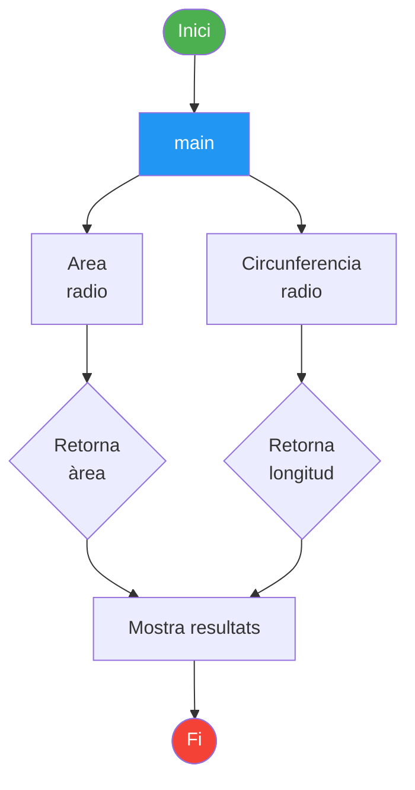
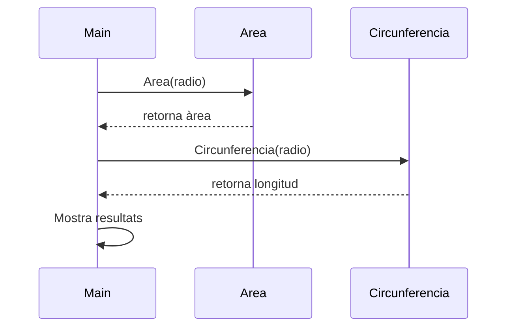
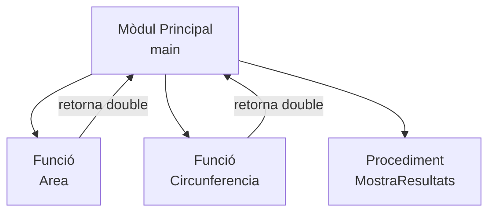

# Programació Modular

Curs 2025 - 2026

---

## Índex

1. [Introducció](#1-introduccio)
2. [Característiques](#2-caracteristiques)
3. [Estructura modular](#3-estructura-modular)
4. [Funcions i subprogrames](#4-funcions-i-subprogrames)
5. [Diagrames](#5-diagrames)
6. [Resum de conceptes clau](#6-resum-de-conceptes-clau)

---

## 1. Introducció

La **programació modular** és un model de programació que consisteix a dividir un programa en mòduls o subprogrames amb la finalitat de fer-lo més llegible i manejable.


És una evolució de la programació estructurada per a problemes més grans i complexos.

!!! info "Definició"
    La programació modular divideix un problema complex en subproblemes més senzills, cadascun resolt per un mòdul independent.

### Divisió de problemes

Un problema complex es divideix en diversos subproblemes més simples.

Els subproblemes poden dividir-se en altres fins a obtenir subproblemes prou senzills.

**Tècnica: Divideix i venceràs**

Exemple: Programa per convertir temperatures


### Avantatges

!!! success "Avantatges de la programació modular"
    - Redueix la complexitat d'un programa
    - Reutilització del codi
    - Millora la claredat i llegibilitat del codi
    - Millora el disseny i la depuració
    - Facilita el manteniment
    - Permet la multiprogramació

---

## 2. Característiques

### Independència funcional

??? tip "Criteris d'independència funcional"
    Un mòdul ha de complir els criteris següents per ser considerat funcionalment independent:

    - :white_check_mark: Un mòdul ha de realitzar una única tasca
    - :white_check_mark: Comunicar-se el menys possible amb altres mòduls
    - :white_check_mark: Dividir fins a aconseguir la independència adequada

### Acoblament

L'**acoblament** mesura la dependència entre mòduls. Com menys acoblament, millor disseny.

!!! warning "Tipus d'acoblament"
    === "Acoblament normal (recomanat)"
        - **Per dades**: intercanvi de dades simples
        - **Per estampat**: estructures compostes
        - **Per control**: flags per a lògica

    === "Altres tipus (a evitar)"
        - **Global**: comparteixen memòria
        - **Per contingut**: accés directe a dades internes

!!! danger "Recomanació"
    **Acoblament per dades** és el tipus recomanat. Evita l'acoblament global i per contingut.

### Cohesió

La **cohesió** mesura la relació interna d'un mòdul. Com més alta, millor.

??? note "Tipus de cohesió (de major a menor qualitat)"
    | Tipus | Qualitat |
    |-------|----------|
    | Funcional | ⭐⭐⭐⭐⭐ Millor |
    | Seqüencial | ⭐⭐⭐⭐ |
    | Comunicacional | ⭐⭐⭐ |
    | Procedural | ⭐⭐ |
    | Temporal | ⭐⭐ |
    | Lògica | ⭐ |
    | Casual | ❌ Pitjor |

    **Recomanat**: Funcional, seqüencial o comunicacional.

---

## 3. Estructura modular

Un mòdul es compon de:

- **Interfície**: entrada i eixida de dades
- **Implementació**: operacions internes

Des de fora és una **caixa negra**, concepte d'**abstracció**.

!!! abstract "Abstracció"
    L'abstracció permet ocultar els detalls interns d'un mòdul mostrant només la seua interfície. Això facilita la reutilització i el manteniment del codi.

---

## 4. Funcions i subprogrames

- Existeix un mòdul principal (**main**)
- Gestiona subalgoritmes
- Els subalgoritmes són cridats des d'un mòdul pare
- Els mòduls fills retornen resultats


### Diferències entre funcions i procediments

!!! note "Funcions vs Procediments"
    - **Funcions**: retornen un resultat
    - **Procediments**: no retornen valor (`void` en Java)

    Les dades es reben mitjançant arguments.

### Exemple sense funcions

```java linenums="1"
final double PI = 3.141592;

public static void main(String[] args) {
    Scanner sc = new Scanner(System.in);
    double radio = sc.nextDouble();
    double area = PI * radio * radio;
    double longitud = 2 * PI * radio;
    System.out.println("El área es: " + area);
    System.out.println("La longitud es: " + longitud);
}
```

### Exemple amb funcions

```java linenums="1"
final double PI = 3.141592;

public static double Area(double radio) {
    return PI * radio * radio;
}

public static double Circunferencia(double radio) {
    return 2 * PI * radio;
}

public static void main(String[] args) {
    Scanner sc = new Scanner(System.in);
    double radio = sc.nextDouble();
    double area = Area(radio);           // (1)
    double longitud = Circunferencia(radio); // (2)
    System.out.println("El área es: " + area);
    System.out.println("La longitud es: " + longitud);
}
```

1. Crida a la funció `Area` passant el radi com a argument.
2. Crida a la funció `Circunferencia` passant el radi com a argument.

??? example "Exemple: càlcul del radi"
    Algoritme que demana el radi d'una circumferència i retorna:

    - Àrea
    - Longitud

    

    Observa com el programa principal delega els càlculs a funcions especialitzades, millorant la llegibilitat i la reutilització.

---

## 5. Diagrames

### Flux de crida entre mòduls

El diagrama següent mostra com el mòdul principal crida als submòduls i com aquests retornen resultats:



### Diagrama de seqüència



### Jerarquia de mòduls



---

## 6. Resum de conceptes clau

| Concepte | Descripció | Recomanació |
|---|---|---|
| Modularitat | Divisió d'un programa en mòduls independents | Dividir problemes grans |
| Acoblament | Nivell de dependència entre mòduls | Baix (millor per dades) |
| Cohesió | Grau de relació entre elements d'un mòdul | Alta (funcional o seqüencial) |
| Interfície | Part del mòdul que defineix entrades i eixides | Clara i ben definida |
| Implementació | Lògica interna del mòdul | Oculta (abstracció) |
| Funció | Subprograma que retorna un valor | Usar per a càlculs |
| Procediment | Subprograma que no retorna valor (`void` en Java) | Usar per a accions |
| Abstracció | Ocultar detalls interns mostrant només el necessari | Pensar en mòduls com a "caixa negra" |

!!! quote "Conclusió"
    La programació modular és fonamental per al desenvolupament de programari de qualitat. Aplicar correctament els principis d'acoblament baix i cohesió alta permet crear sistemes mantenibles, reutilitzables i fàcils d'entendre.
