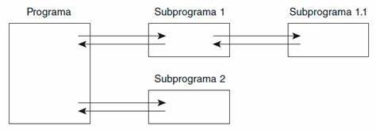
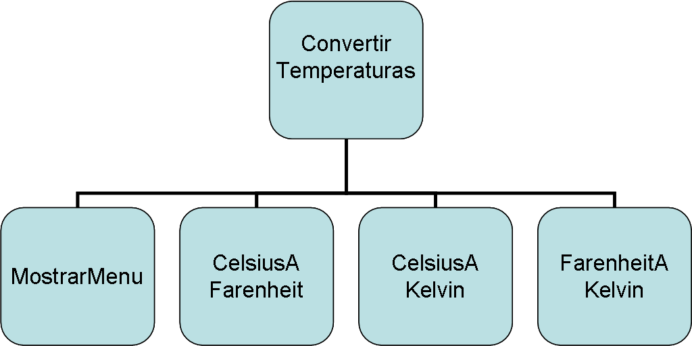
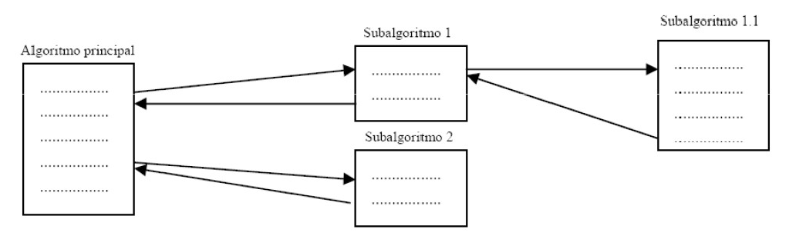
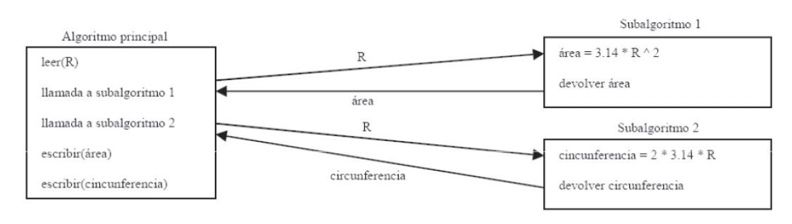
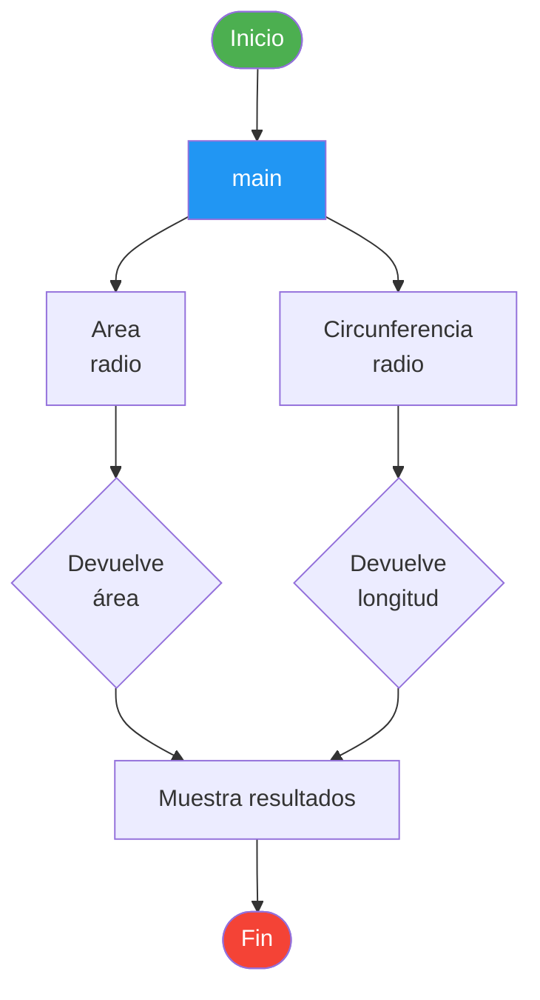
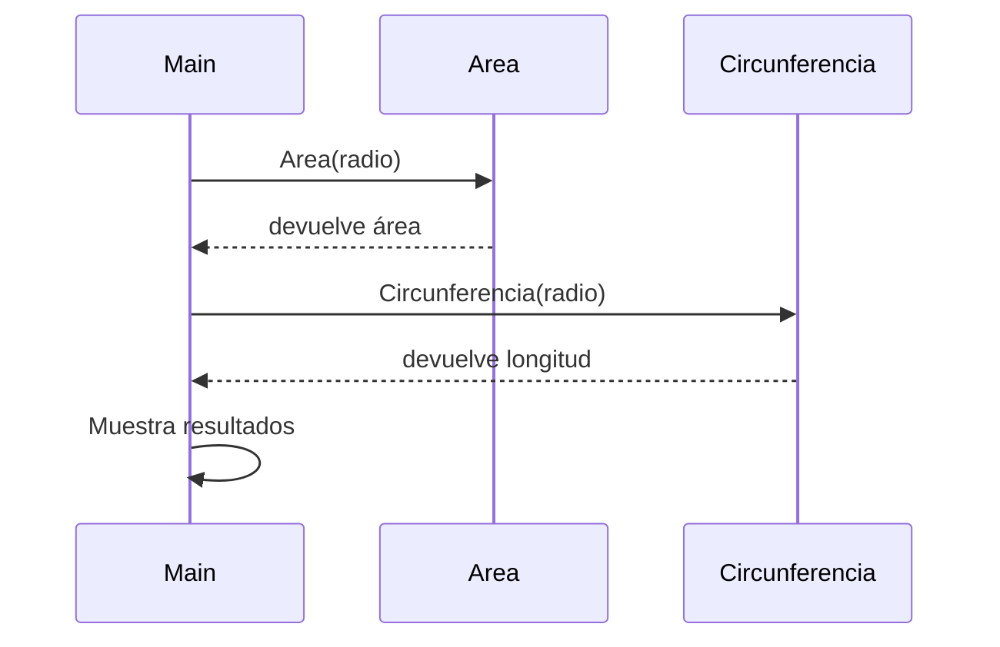

# Programación Modular  
Curso 2025 - 2026  

---

## Índice

1. [Introducción](#1-introduccion)  
2. [Características](#2-caracteristicas)  
3. [Estructura modular](#3-estructura-modular)  
4. [Funciones](#4-funciones)  
5. [Diagramas](#5-diagramas)  
6. [Resumen de conceptos clave](#6-resumen-de-conceptos-clave)

---

## 1. Introducción

La programación modular es un modelo de programación que consiste en dividir un programa en módulos o subprogramas con el fin de hacerlo más legible y manejable.



Es una evolución de la programación estructurada para problemas más grandes y complejos.

!!! info "Definición"
    La programación modular divide un problema complejo en subproblemas más sencillos, cada uno resuelto por un módulo independiente.

### División de problemas

Un problema complejo es dividido en varios subproblemas más simples.

Los subproblemas pueden dividirse en otros hasta obtener subproblemas lo suficientemente sencillos.

**Técnica: Divide y vencerás**

Ejemplo: Programa para convertir temperaturas



### Ventajas

!!! success "Ventajas de la programación modular"
    - Reduce la complejidad de un programa  
    - Reutilización del código  
    - Mejora la claridad y legibilidad del código  
    - Mejora el diseño y la depuración  
    - Facilita el mantenimiento  
    - Permite la multiprogramación  

---

## 2. Características

### Independencia funcional

??? tip "Criterios de independencia funcional"
    Un módulo debe cumplir los siguientes criterios para ser considerado funcionalmente independiente:

    - :white_check_mark: Un módulo debe realizar una única tarea  
    - :white_check_mark: Comunicarse lo menos posible con otros módulos  
    - :white_check_mark: Dividir hasta lograr independencia adecuada  

### Criterios

- **Acoplamiento**: dependencia entre módulos  
- **Cohesión**: relación interna del módulo  

### Acoplamiento

El **acoplamiento** mide la dependencia entre módulos. Cuanto menor sea, mejor diseño.

!!! warning "Tipos de acoplamiento"
    === "Acoplamiento normal (recomendado)"
        - **Datos**: intercambio de datos simples  
        - **Estampado**: estructuras compuestas  
        - **Control**: flags para lógica  

    === "Otros tipos (a evitar)"
        - **Global**: comparten memoria  
        - **Por contenido**: acceso directo a datos internos  

!!! danger "Recomendación"
    **Acoplamiento por datos** es el tipo recomendado. Evita el acoplamiento global y por contenido.

### Cohesión

La **cohesión** mide la relación interna de un módulo. Cuanto más alta, mejor.

??? note "Tipos de cohesión (de mayor a menor calidad)"
    | Tipo | Calidad |
    |------|---------|
    | Funcional | ⭐⭐⭐⭐⭐ Mejor |
    | Secuencial | ⭐⭐⭐⭐ |
    | Comunicacional | ⭐⭐⭐ |
    | Procedural | ⭐⭐ |
    | Temporal | ⭐⭐ |
    | Lógica | ⭐ |
    | Casual | ❌ Peor |

    **Recomendado**: Funcional, secuencial o comunicacional.

---

## 3. Estructura modular

Un módulo se compone de:

- **Interfaz**: entrada y salida de datos  
- **Implementación**: operaciones internas  

Desde fuera es una **caja negra**, concepto de **abstracción**.

!!! abstract "Abstracción"
    La abstracción permite ocultar los detalles internos de un módulo mostrando solo su interfaz. Esto facilita la reutilización y el mantenimiento del código.

---

## 4. Funciones

- Existe un módulo principal (**main**)  
- Gestiona subalgoritmos  
- Los subalgoritmos son llamados desde un módulo padre  
- Los módulos hijos devuelven resultados  



### Subprogramas

Los subprogramas se llaman funciones y procedimientos.

Un subprograma:

1. Acepta datos de entrada  
2. Procesa los datos  
3. Devuelve resultados  

El algoritmo principal construye la solución global.

### Diferencias

!!! note "Funciones vs Procedimientos"
    - **Funciones**: devuelven un resultado  
    - **Procedimientos**: no devuelven valor  

    En Java los procedimientos devuelven `void`. Los datos se reciben mediante argumentos.

### Ejemplo

??? example "Ejemplo: cálculo del radio"
    Algoritmo que pide el radio de una circunferencia y devuelve:

    - Área  
    - Longitud  

    

### Ejemplo sin funciones

```java linenums="1"
final double PI = 3.141592;
public static void main(String[] args) {
    Scanner sc = new Scanner(System.in);
    double radio = sc.nextDouble(); 
    double area = PI * radio * radio;
    double longitud = 2 * PI * radio;
    System.out.println("El área es: "+area);
    System.out.println("La longitud es: "+longitud);
}
```

### Ejemplo con funciones

```java linenums="1"
final double PI = 3.141592;

public static double Area (double radio) { 
    return PI * radio * radio;
}

public static double Circunferencia (double radio) {
    return 2 * PI * radio;
}

public static void main(String[] args) {
    Scanner sc = new Scanner(System.in);
    double radio = sc.nextDouble(); 
    double area = Area(radio);           // (1)
    double longitud = Circunferencia(radio); // (2)
    System.out.println("El área es: "+area);
    System.out.println("La longitud es: "+longitud);
}
```

1. Llamada a la función `Area` pasando el radio como argumento.
2. Llamada a la función `Circunferencia` pasando el radio como argumento.

---

## 5. Diagramas

### Flujo de llamada entre módulos

El diagrama siguiente muestra cómo el módulo principal llama a los submódulos y cómo estos devuelven resultados:



### Diagrama de secuencia



---

## 6. Resumen de conceptos clave

| Concepto        | Descripción                                                                 | Recomendación                          |
|----------------|-----------------------------------------------------------------------------|----------------------------------------|
| Modularidad    | División de un programa en módulos independientes                          | Dividir problemas grandes              |
| Acoplamiento   | Nivel de dependencia entre módulos                                         | Bajo (mejor por datos)                 |
| Cohesión       | Grado de relación entre elementos de un módulo                             | Alta (funcional o secuencial)          |
| Interfaz       | Parte del módulo que define entradas y salidas                             | Clara y bien definida                  |
| Implementación | Lógica interna del módulo                                                  | Oculta (abstracción)                   |
| Función        | Subprograma que devuelve un valor                                          | Usar para cálculos                     |
| Procedimiento  | Subprograma que no devuelve valor (`void` en Java)                         | Usar para acciones                     |
| Abstracción    | Ocultar detalles internos mostrando solo lo necesario                      | Pensar en módulos como "caja negra"    |

!!! quote "Conclusión"
    La programación modular es fundamental para el desarrollo de software de calidad. Aplicar correctamente los principios de acoplamiento bajo y cohesión alta permite crear sistemas mantenibles, reutilizables y fáciles de entender.
